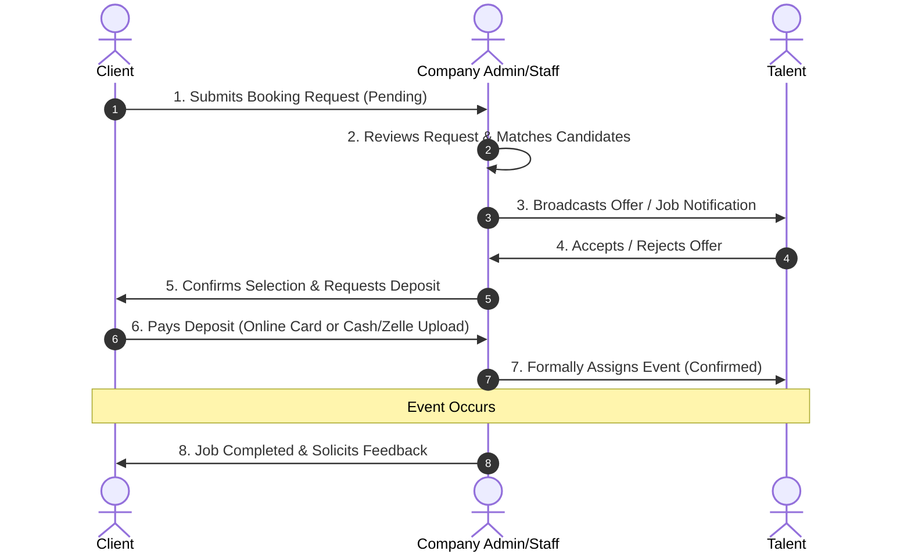

# Talentum - Platform Architecture & Features Documentation

Welcome to the comprehensive documentation of **Talentum**, a premium multi-tenant SaaS platform tailored for booking and talent management agencies. Talentum empowers multiple agencies (companies) to register, set up custom-branded workspaces, manage their rosters (performers, models, entertainers), and seamlessly process event bookings and payments.

---

## 📖 Table of Contents
1. [Platform Overview & Core Architecture](#1-platform-overview--core-architecture)
2. [Multi-Tenant Data Isolation Strategy](#2-multi-tenant-data-isolation-strategy)
3. [Firestore Database Schema & Security Models](#3-firestore-database-schema--security-models)
4. [User Roles & Access Control (RBAC)](#4-user-roles--access-control-rbac)
5. [Detailed Feature Outlines](#5-detailed-feature-outlines)
6. [The Interactive Booking Lifecycle Flow](#6-the-interactive-booking-lifecycle-flow)
7. [Alternative Payments & screenshot Uploads](#7-alternative-payments--screenshot-uploads)
8. [Automated Notification Subsystem](#8-automated-notification-subsystem)
9. [Project Directory & Core Components Mapping](#9-project-directory--core-components-mapping)

---

## 1. Platform Overview & Core Architecture

Talentum is engineered as a modern, high-performance, single-instance multi-tenant application built on Next.js (App Router), React, TypeScript, and Tailwind CSS. The backend capabilities are driven by Firebase (Firestore Database + Firebase Authentication).

```mermaid
graph TD
    User([Platform Client / Talent / Admin]) -->|Requests Route| Middleware[Next.js Middleware: Slug Lowercase Normalize]
    Middleware -->|Resolves Slug| AppRouter[Next.js App Router: /[companyId]/dashboard]
    AppRouter -->|Loads Branding| CompanyContext[CompanyContext: Firestore Live Config]
    AppRouter -->|Loads User Details| AuthContext[AuthContext: Consolidated Auth Profile]
    CompanyContext -->|Injects HSL CSS Custom Properties| DOM[Client DOM: Custom CSS Brand Variables]
```

### ⚡ Technical Stack Highlights
* **Core Framework:** Next.js 14+ (App Router)
* **Language:** TypeScript for type safety and clean interfaces
* **Styling:** Vanilla CSS Custom Variables integrated with Tailwind CSS for robust, scalable aesthetic customizations
* **Database & Authentication:** Google Firebase (Firestore real-time streams & Firebase Authentication)
* **File Hosting:** Local Host / Media Server storage for uploaded assets (images, videos, documents, receipts) rather than native Firebase storage, reducing database overhead.

---

## 2. Multi-Tenant Data Isolation Strategy

A core requirement of Talentum is absolute data isolation. Data belonging to Company A must never be accessible, visible, or modifiable by Company B. This is enforced through both client-side context verification and database-level security rules.

### Client-Side Segregation (Next.js Middleware & Context)
1. **Slug Case Normalization:** [`src/middleware.ts`](file:///f:/WEB%20APPS/COMPANY/Talentum/src/middleware.ts) enforces lowercase routing for all tenant paths `/[companyId]`. A request to `/Acme-Agency/login` gets a 308 Permanent Redirect to `/acme-agency/login`.
2. **Context Association:** The [`CompanyProvider`](file:///f:/WEB%20APPS/COMPANY/Talentum/src/context/CompanyContext.tsx) resolves the active tenant's details based on the URL segment and user parameters, applying specific branding colors dynamically using HSL-based Tailwind classes.
3. **Route Guards:** The [`ProtectedRoute`](file:///f:/WEB%20APPS/COMPANY/Talentum/src/components/ProtectedRoute.tsx) confirms that `user.companyId` strictly matches the dynamic URL `companyId` before allowing access to non-platform admin users.

### Database-Side Segregation (Firestore Rules)
Every query on tenant-specific data is scoped by the company's identifier. The [`firestore.rules`](file:///f:/WEB%20APPS/COMPANY/Talentum/firestore.rules) file employs helper functions to validate permissions:
* `belongsToCompany(companyId)`: Asserts `getUserData().companyId == companyId || isPlatformAdmin()`.
* It restricts data reading/writing to ensure users can only query documents tagged with their own matching `companyId`.

---

## 3. Firestore Database Schema & Security Models

Below is the database organization modeled across Talentum's Firestore instance:

### 🗂️ Users Collection (`/users/{userId}`)
Stores global user profiles including logins, roles, and company affiliations.
* **Fields:** `uid`, `email`, `role`, `companyId`, `name`, `displayName`, `photoUrl`, `profileImage`.
* **Rules:** Users can write to their own profile. Platform Admins have full access. Company Admins/Staff can read user records inside their own company.

### 🏢 Companies Collection (`/companies/{companyId}`)
Hosts specific agency workspaces.
* **Fields:** `id`, `name`, `logoUrl`, `brandColor`, `brandSecondary`, `brandAccent`, `brandText`.
* **Nested Subcollections:**
  * `talentTypes/{docId}`: Specific categories of performers (e.g. Model, Dancer, Host).
  * `genders/{docId}`: Gender parameters used in listings and searching.
  * `locations/{stateId}`: Geographical states containing nested `/cities/{cityId}` documents.
  * `settings/{settingId}`: Dynamic booking form structures and agency-wide options.

### 🎭 Talents Collection (`/talents/{talentId}`)
Contains professional profiles, pricing, bio details, and media files for performers.
* **Fields:** `uid`, `email`, `name`, `displayName`, `bio`, `rate` (hourly/flat), `services` (array), `serviceArea`, `photoUrl`, `gallery` (array), `socials`, `availability` (calendar schedules).
* **Rules:** Talents can update their profiles. Company Admins/Staff can create or delete talents inside their respective company scope.

### 📅 Bookings Collection (`/bookings/{bookingId}`)
Tracks all client booking negotiations and logs gig steps.
* **Fields:** `bookingId`, `companyId`, `clientId`, `talentId` / `selectedTalentId`, `eventDate`, `eventTime`, `eventLocation`, `eventType`, `specialInstructions`, `status`, `applicants` (array of interested talents), `depositAmount`, `isDepositPaid`, `receiptUrl` (for alternative payments).
* **Rules:** Partitioned so clients can read their own bookings, talents can see their offers, and company admins/staff have comprehensive management rights within their matching `companyId`.

### 📝 Auxiliary Collections
* `pending_profile_updates/{updateId}`: Acts as a staging database for talent updates, requiring admin approval before merging into the main `/talents` profile.
* `talent_activity_logs/{logId}`: Audit logs for admin and staff to monitor booking shifts.
* `notifications/{notificationId}`: Internal communication notifications.
* `platform_roles/{roleId}`: Dynamic permission registers mapped by the `usePlatformPermissions` hook.

---

## 4. User Roles & Access Control (RBAC)

Talentum supports granular, role-based accessibility to ensure operational balance:

| Role | Access Level | Responsibilities |
| :--- | :--- | :--- |
| **Platform Admin** | Platform-Wide | System settings, register new agency companies, suspend/activate companies, platform-wide metrics. |
| **Company Admin** | Company-Wide (Full) | Roster management, adjust booking forms, verify profile updates, manage staff, handle invoice overrides, set branding. |
| **Staff / Manager** | Company-Wide (Limited) | Process bookings, assign performers, run calendars, review applications. |
| **Talent / Performer** | Self-Service Portal | Modify portfolio, set blackout dates, accept or reject gig offers, track tips and payment histories. |
| **Client** | Self-Service Portal | Search and filter performers, create bookings, submit deposits, review receipts, sign digital waivers. |

---

## 5. Detailed Feature Outlines

### 🎨 1. Dynamic Branding Engine
Agencies can modify their workspace logo and theme directly from the settings panel. Firestore real-time snapshots instantly distribute these modifications down to custom HSL variables on the DOM, changing buttons, sidebars, active highlights, and headers instantly without rebuilding code.

### 🎭 2. Double-Approved Portfolio Updates
To maintain professional portfolio quality, when a Talent updates their services, bio, or photos, the changes do not publish immediately. Instead, they are routed to `pending_profile_updates` where a Company Admin reviews and merges them, ensuring quality control.

### 🗺️ 3. Dynamic Location & Type Filtering
Clients can search through performers via a robust search engine, isolating results by Category (Job Type), Gender, and Location. Locations are stored in a nested State-to-City directory framework to enable high-accuracy localized talent matches.

### ✍️ 4. Automated Digital Waiver System
Before secure event execution, the platform forces the signing of standard waivers. Talentum records e-signatures, capture timestamps, and stores files alongside the booking document.

### 💸 5. Tip & Earnings Tracker
Clients are presented with optional tipping prompts during invoice checkout. Approved tips are directly logged into the individual talent’s earnings dashboard metadata.

---

## 6. The Interactive Booking Lifecycle Flow

Talentum's core logic manages a structured, fail-safe booking pipeline:



1. **Job Creation:** The client specifies event type, date/time, location, and requested talent.
2. **Matching Engine:** The platform filters which talents qualify based on criteria like state, city, and category.
3. **Offer Phase:** Matched performers are notified via an invitation framework to accept or reject the job.
4. **Fulfillment Closing:** Once the required number of performers has been secured, the job closes automatically, updating all other candidates to release their calendar blocks.

---

## 7. Alternative Payments & Screenshot Uploads

Recognizing that many client bookings are settled outside digital gateways, Talentum incorporates a hybrid ledger system:

* **Stripe / Authorize.net:** For real-time card and bank draft payments.
* **Manual Payments (Zelle, Cash, Wire Transfer):**
  * Clients can submit proof of payment directly from their portal.
  * The system prompts the client to specify the alternative payment method used and upload an image/screenshot of the bank confirmation or cash receipt.
  * These uploads are kept securely within the transaction logs, allowing staff to review and click **"Approve Manual Deposit"** to shift the booking to "Confirmed" status.

---

## 8. Automated Notification Subsystem

To maintain fast booking cycle times, Talentum notifies users regarding state transitions:

* **API Endpoints:** Managed at [`src/app/api/notify/route.ts`](file:///f:/WEB%20APPS/COMPANY/Talentum/src/app/api/notify/route.ts).
* **Delivery Routes:** 
  * **Email notifications** (e.g., PHPMailer or Resend integrations) trigger booking outlines, congratulatory messages to assigned talent, or digital invoices.
  * **SMS notifications** (e.g., Twilio integrations) broadcast urgent gig offers directly to performer smartphones to keep response windows short.

---

## 9. Project Directory & Core Components Mapping

Below is an overview of the primary workspace source code files:

### 🧩 Contexts
* [`AuthContext.tsx`](file:///f:/WEB%20APPS/COMPANY/Talentum/src/context/AuthContext.tsx): Manages global identity states, permissions, and company linkages.
* [`CompanyContext.tsx`](file:///f:/WEB%20APPS/COMPANY/Talentum/src/context/CompanyContext.tsx): Drives dynamic brand variables and theme colors across the browser layout.

### 🛠️ Common Utilities & Hooks
* [`alerts.ts`](file:///f:/WEB%20APPS/COMPANY/Talentum/src/lib/alerts.ts): Toast notifications and feedback flags.
* [`db-utils.ts`](file:///f:/WEB%20APPS/COMPANY/Talentum/src/lib/db-utils.ts): Helper modules to fetch lists of talents, locations, or status filters.
* [`usePlatformPermissions.ts`](file:///f:/WEB%20APPS/COMPANY/Talentum/src/hooks/usePlatformPermissions.ts): Computes operational rights maps, preventing non-privileged staff from making structural modifications.

### 💻 UI Components
* [`BookingForm.tsx`](file:///f:/WEB%20APPS/COMPANY/Talentum/src/components/bookings/BookingForm.tsx): An extensive interactive multi-step booking module with dynamic field queries.
* [`Sidebar.tsx`](file:///f:/WEB%20APPS/COMPANY/Talentum/src/components/layout/Sidebar.tsx): The high-fidelity sidebar that reacts directly to the authenticated user's role.
