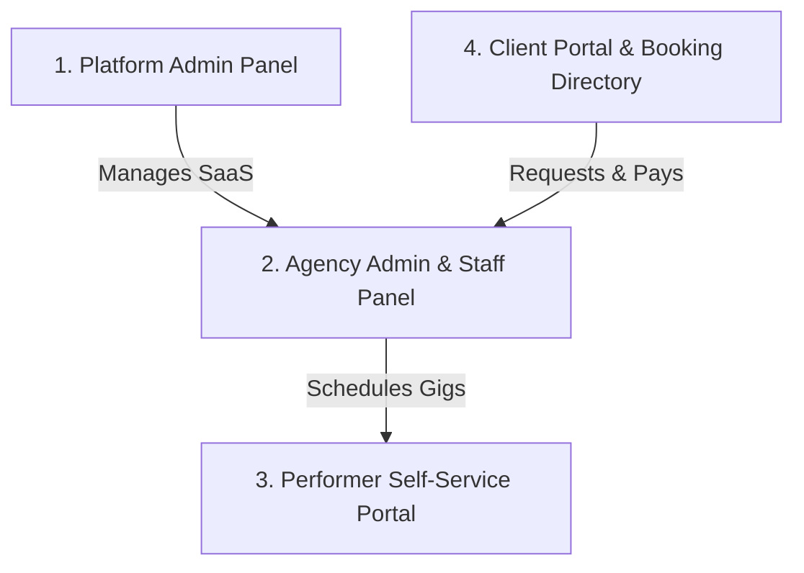

# Talentum - Multi-Tenant SaaS Presentation Guide

Welcome to the official presentation outline and guide for **Talentum**, a premium, multi-tenant Booking and Talent Management SaaS.

---

## 🎨 SaaS Presentation Slide Showcase

---

## 🚀 1. Platform Identity & Tech Stack
**Talentum** is an ultra-premium, modern, single-instance multi-tenant software built to optimize agency bookings, portfolio reviews, and performer management.

### ⚡ Tech Stack Details:
* **Core Frontend Framework:** Next.js 14/15 (App Router)
* **Programming Language:** TypeScript (for type safety and enterprise integrity)
* **Styling & Theme Engine:** Tailwind CSS combined with Vanilla CSS HSL Custom Properties (allowing real-time client-side branding changes)
* **Database & Authentication:** Google Firebase (Firestore real-time streams & Firebase Authentication)
* **Email & SMS Transporters:** Nodemailer SMTP Integration & Twilio API gateways
* **Asset Storage:** High-performance local media storage node (prevents Firebase Storage data overhead)

### 📊 Tech Stack Visual Architecture

---

## 🌟 2. Main Features
Talentum solves the hardest challenges in agency management with enterprise-grade features:

* **Strict Multi-Tenant Isolation:**
  - Case-normalizing Next.js middleware forces lowercase routing (`/[companyId]`).
  - Route guards and context isolation ensure Company A can never view Company B's data.
  - Server-side Firestore Rules assert absolute identity verification.
* **Dynamic Branding Engine:**
  - Agency admins customize colors and logos in real-time.
  - Snapshot updates instantly inject CSS custom HSL properties on the DOM without codebase rebuilds.
* **Dual-Approved Portfolio Changes:**
  - Talents upload bio updates or photos to a staging collection (`pending_profile_updates`).
  - Admins review and merge changes, ensuring roster quality control.
* **State-to-City Directory Filtering:**
  - Multi-level geolocation filters map talent locations down to specific cities.
* **Alternative Payments Ledger:**
  - Hybrid checkout supporting Stripe cards alongside manual payment screenshots (Zelle, wire transfer, cash) with admin approval queues.
* **Security-Enforced Resets:**
  - Custom password resets generating secure tokens that expire in exactly **3 hours** to prevent data breach risks.

### 📊 Key Features Visual Slide

---

## 📊 3. Core Panels (Total: 4)

Talentum segregates system users into **4 distinct panels**, each optimized for a specific workflow:

### 📊 Core Panels Visual Architecture

---

## ⚙️ 4. Panel Details & Feature Lists

### 🛡️ Panel 1: Platform Admin Panel (Master Panel)
*Route: `/master`*
> Designed for SaaS owners to manage subscription revenue and billing states.
* **Agency & Workspace Control:**
  - Create new workspaces, allocate trial tokens, and disable or enable companies.
  - Lock disabled companies instantly, shifting their workspace UI to a support-only lock screen.
* **Subscription & Plan Manager:**
  - Set pricing tiers, free trial durations, and stripe billing linkages.
* **Universal Helpdesk System:**
  - Unified ticketing interface to view, reply, and resolve help tickets submitted by agency admins.
* **Analytics Metrics Dashboard:**
  - Real-time revenue trackers, registration counts, active bookings, and system-wide performance statistics.

---

### 🏢 Panel 2: Company/Agency Admin & Staff Panel
*Route: `/[companyId]/dashboard/admin`*
> Designed for agency owners and bookers to run operations.
* **Booking Pipeline Control:**
  - Live pipeline tracking (Pending, Confirmed, Completed, Cancelled).
  - Assign performers, override invoice amounts, adjust deposit parameters.
* **Roster Management:**
  - Add talent accounts, review staging requests, set payout percentages, or suspend performers.
* **Booking Form & Geolocation Customizer:**
  - Manage custom categories, states, cities, waiver documents, and tax/booking fee rules.
* **Helpdesk & Ticket Creator:**
  - Generate support tickets for platform admins, view thread history, and reply directly from the locked or active dashboard.
* **Theme Customizer:**
  - Real-time brand upload (Logo, brand primary, secondary, and accent colors).

---

### 🎭 Panel 3: Performer Self-Service Portal
*Route: `/[companyId]/dashboard/talent`*
> Designed for performers/talent to manage their freelance roster entries.
* **Portfolio Self-Service:**
  - Modify showcase service tags, pricing rates (hourly or flat), photo galleries, and social media handles.
* **Booking Schedule & Calendar:**
  - View assignment details, client requirements, map coordinates, and select "Accept" or "Decline" on broadcasted gig invitations.
  - Set custom calendar blackout dates to prevent booking collisions.
* **Earning & Tip Dashboard:**
  - Track completed bookings, cash payouts, and client tip logs.

---

### 👥 Panel 4: Client Portal & Booking Directory
*Route: `/[companyId]/dashboard/client`*
> Designed for clients (event organizers) looking to hire performers.
* **Roster Search Directory:**
  - Dynamic filters for category, gender, and city mapping. View high-resolution performer portfolios.
* **Interactive Booking Builder:**
  - Multi-step checkout form detailing location, special instructions, and assigned performers.
* **Payment Screenshot Upload:**
  - Process deposits via cards or upload screenshot receipts for Zelle/bank validations.
* **Digital Signatures:**
  - Read and e-sign legal waivers and service agreements before gig validation.

